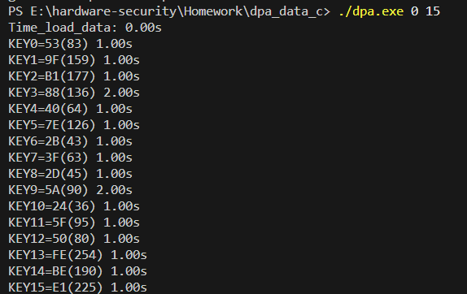

## 
DPA攻击AES-128的轮密钥

| **学号**   | **专业班级** | **姓名** |
| ---------- | ------------ | -------- |
| 3200100574 | 图灵2001     | 宋佳铮   |

## 1.  Project Introduction

AES（Advanced Encryption Standard）是现代密码学中最常用且最安全的对称加密算法之一。本次实验是在知道功耗曲线以及对应密文的前提下，使用差分攻击的方式攻击AES-128第10轮的加密过程，从而获得第10轮的轮密钥。实验使用C语言实现。

## 2.  Technical Details

本次实验主要用到了DPA的攻击算法。算法形式化的描述如下：

- 遍历猜测密钥的某一个byte，并根据密文（明文），计算第十轮中的功耗模型结果
- 根据功耗模型结果将对应功耗曲线分类为两组进行差分
- 找到差分结果出现最大尖峰的密钥，将其作为最终该byte密钥的猜测值。

本次实验中需要注意的是，我们拥有的是密文以及功耗曲线，因此只能对AES-128加密的第10轮进行攻击。有以下注意点：

- 计算功耗模型：在猜测第n个block的密钥的时候，对应计算$Haiming Distance$并不是根据第n个byte的密文以及其逆向的$s\_box$输入来进行的，因为将功耗往硬件抽象思考，其是同一组寄存器电压变化造成的。第n个byte密钥与密文异或再反查，逆向得到的$s\_box$输入的$index=shift\_row[n]$，因为实际上，行移位，寄存器并不移位，所以计算功耗模型时$Change=ciper[index]\oplus s\_boxinput$。

- 按照[原始论文](https://www.researchgate.net/publication/241536041_Hamming_Distance_Model_Based_Power_Analysis_for_Cryptographic_Algorithms)描述的根据$HaimingDistance$大于4分一组，小于4分一组，进行差分一次，结果并不成功，可能是数据不够多或者预处理不够好。本实验采取的是扩大样本的方式，根据获得的密文byte的每一位是否变化的$Change$结果，将功耗曲线在每个bit上都分成两组，使得总数扩大了8倍，将每个bit的差分结果累加，作为猜测密钥的最终差分功耗曲线。

- 根据第十轮轮密钥恢复主密钥的思路如下：

  - 将之前的16byte轮密钥合并生成4个column分别置于密钥数组key[40]-key[43]。

  - 根据轮密钥扩展算法异或的可逆性，反向计算key[0]-key[3]，用到s-box以及轮常数数组Rcon。
    $$
    key[i] =
    \begin{cases}
      key[i+4]\oplus key[i+3] & \text{if } i\%4 \neq 0\\
      key[i+4]\oplus Rcon[i/4]\oplus S\_box(Rot(key[i+3])) & \text{if } i\%4 = 0
    \end{cases}
    $$
    其中Rot函数为4个byte的循环左移1byte函数

## 3.  Experiment Results

实验成功恢复第十轮的128bit轮密钥，验证byte 0 is 0x53，byte 6 is 0x2B。

